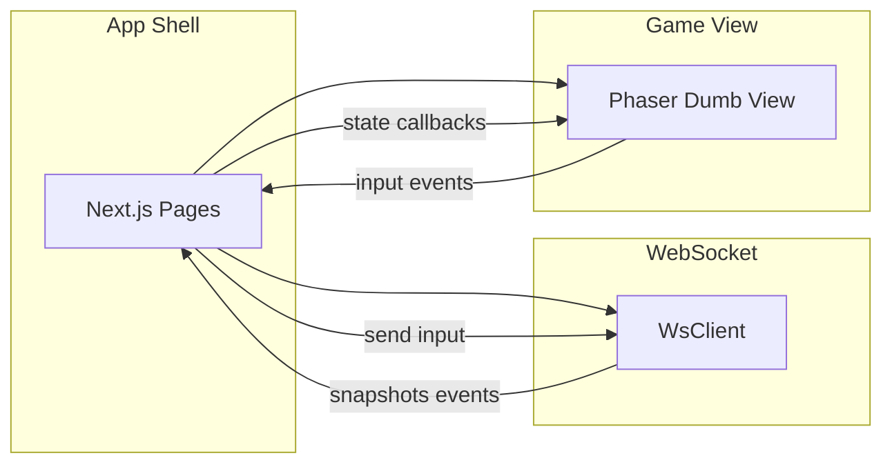

# Frontend Architecture — Detonadores (US-001)

Technical stack, renderer decision, and module boundaries for the client. The server is authoritative; the client renders snapshots and sends input only.

**Renderer (project decision):** Phaser. The game view is a **"Dumb View"**: it renders match state from the server and emits player input; it does not run authoritative game logic.

---

## 1. Technical stack

| Layer | Technology |
|-------|------------|
| Framework | Next.js (App Router) |
| UI | React, TypeScript |
| Styling | Tailwind CSS |
| Game canvas | Phaser |
| Build | Next.js |

---

## 2. Module boundaries

- **App shell (Next.js):** Routes and pages for Auth, Dashboard, Room browser, Lobby, Match screen (container), Results screen. Feature-sliced structure so each product surface lives in a clear slice under `src/features/`.
- **Game view (Phaser):** Isolated in the match feature. Receives match state (snapshots) and emits player input via callbacks. No direct HTTP/WebSocket inside Phaser—state and callbacks are injected from the React/Next.js layer.
- **WebSocket client:** Own module under `src/shared/lib`. Connects to backend, sends client events (`room:create`, `room:join`, `match:input`, etc.), receives server events (`room:state`, `match:snapshot`, `match:event`, `match:ended`). Used by Lobby and Match containers; Phaser receives data from the parent that uses the WebSocket client.

---

## 3. Client responsibilities

| Responsibility | Description |
|----------------|-------------|
| **UI rendering** | Next.js/React for app shell; Phaser for in-match view (tilemap, players, bombs, explosions). |
| **Input capture** | Keyboard/gamepad in Phaser or React; events sent as `match:input` / `match:place_bomb` via WebSocket. |
| **WebSocket communication** | Single client adapter; connect with **`?token=`** from guest session (US-028). Session from **`POST /session/guest`** stored in `localStorage`; protected routes use `RequireGuestSession`. |
| **Interpolation** | Client-side smoothing of positions/state between server snapshots for display only; authoritative state remains server-side. |

---

## 4. Data flow

- **Server is authoritative.** Client receives snapshots/events and may interpolate for display.
- **Movement:** Final player position always comes from `snapshot.players`; the Phaser view only interpolates (lerp) from current display position toward the snapshot position for smooth rendering. Collision and tile rules are resolved on the server; the client does not override position.
- Client sends only **input events**; no duplicate game logic on the client.
- Match state flows: Server → WebSocket → App shell → Phaser (render). Input flows: Phaser/React → App shell → WebSocket → Server.

**Interpolation and reconciliation (US-017):** In online mode the client buffers the last two snapshots with receive timestamps. Player positions are interpolated between the two snapshots using time-based alpha; grid, bombs, explosions, powerups, and alive/death come from the latest snapshot so they stay authoritative and readable. If the interpolated position deviates from the latest authority by more than 0.5 tiles, the display snaps to authority. Extrapolation is not used (alpha is capped at 1) so the client never shows state ahead of the server. Reconciliation happens within one frame when over threshold; impossible states are not shown for more than a short window.

---

## 5. Dependency rule

- **shared** (types, lib, ui): no dependency on features or app.
- **features**: may use shared and entities.
- **app** (pages): uses features and shared.
- **Phaser (game view):** used by the match feature; does not import Next.js or WebSocket—state and callbacks are passed in.

---

## 6. WebSocket message contract

WebSocket message shapes (event types, payloads, error codes) are defined in **`docs/websocket-contract.md`** at project root. The frontend implements them in `src/shared/types` (discriminated unions for `ClientEvent` and `ServerEvent`, including `error`); the WebSocket client stub in `src/shared/lib/ws-client.ts` uses these types.
